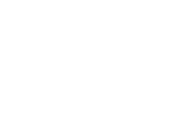

# 
# Robot-Main-Crescendo: Robotalons Crescendo Season Code

## Installation & Setup

Below is a list of instructions to properly *build* the project, see [requirements](##Requirements)

1. Clone the repository with `git clone https://github.com/FRC5411/robot-main-crescendo5411.git`
2. Build the repository with `./gradlew build` or `./gradlew build` if you do not have a local gradle installation

## Requirements

- [JDK 17+](https://adoptium.net/temurin/releases/?version=17)
    - Ubuntu: run `sudo apt install openjdk-17-jdk`
    - Windows: install the JDK 17 .msi from the link above
    - macOS: install the JDK 17 .pkg from the link above
- [Gradle 7+ (Optional)](https://gradle.org/releases/)
    - Follow Gradle's installation [guide](https://gradle.org/install/#prerequisites)
- [WPI VSCode (Optional)](https://github.com/wpilibsuite/allwpilib/releases/tag/v2023.4.3)
    - Follow WPILib's [guide](https://docs.wpilib.org/en/stable/docs/zero-to-robot/step-2/wpilib-setup.html)
- [AdvantageScope (Optional)](https://github.com/Mechanical-Advantage/AdvantageScope/releases)
    - Install the latest Release for your OS and Architecture
    - Execute the distribution to start the Install Wizard
      
## Structure & Organization

The project is organized based on WPILib's command-based control structure modified to fit our own needs and can be found [here](https://docs.google.com/document/d/1IrDxQFM6M3gsqsZLIETJGJXaWM8zJ7IgAcHsC6BfKdk/edit?usp=sharing).
